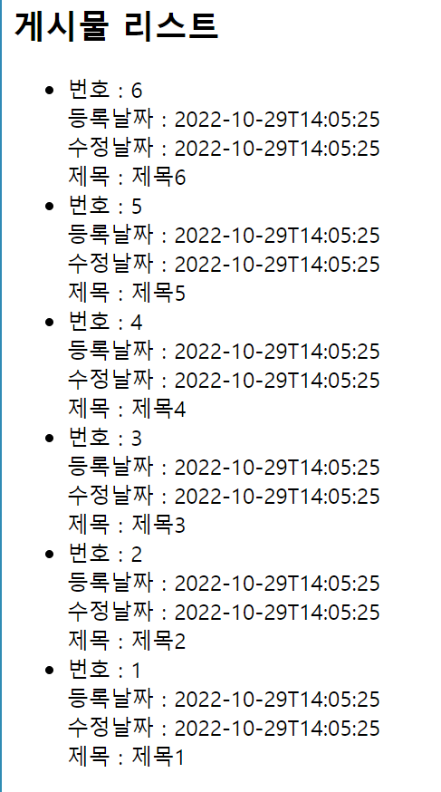

<div id="top"></div>
<!--
*** Thanks for checking out the Best-README-Template. If you have a suggestion
*** that would make this better, please fork the repo and create a pull request
*** or simply open an issue with the tag "enhancement".
*** Don't forget to give the project a star!
*** Thanks again! Now go create something AMAZING! :D
-->

<!-- PROJECT SHIELDS -->
<!--
*** I'm using markdown "reference style" links for readability.
*** Reference links are enclosed in brackets [ ] instead of parentheses ( ).
*** See the bottom of this document for the declaration of the reference variables
*** for contributors-url, forks-url, etc. This is an optional, concise syntax you may use.
*** https://www.markdownguide.org/basic-syntax/#reference-style-links
-->

<!-- PROJECT LOGO -->
<br />
<div align="center">
<h3 align="center">Similar Spring Project (Spirng 프레임워크 구현)</h3>

  <p align="center">
    Similar Spring Project (Spirng 프레임워크 구현)
    <br />
    <a href="https://github.com/kimdonghyeon3/Similar_Spring"><strong>View Demo »</strong></a>
    <br />
    <br />

  </p>
</div>

<hr/>

<!-- ABOUT THE PROJECT -->
## About The Project



이전에 Spring에서 Tomcat과 Servlet을 활용해서 Spring Legacy 프로젝트를 진행해 본 적 있다.
그러나 해당 구조에서는 최대한 Spring에서 제공하는 라이브러리를 사용을 자제하고 MVC 구조를 구현해 나가는
프로젝트였다. 그러나 진정 Spring 프레임워크가 어떻게 동작하고, 자주 사용하는 기능들이 어떻게 만들었어지고
흐름은 어떠한지 이해해 보기 위해서 프로젝트를 진행해 보았다.

프로젝트는 Java 프로젝트로 시작하여, tomcat, Servlet, junit5, lombok, reflections, mysql-driver를 통해서
직접 Spring 프레임 워크를 구현한 프로젝트이다. 자주 사용되는 어노테이션을 직접 구현해보고,
Servlet을 통해 들어오는 url을 맵핑하는 과정 db와의 연동을 직접 구현해보는 경험을 할 수 있다.

<p align="right">(<a href="#top">back to top</a>)</p>

<!-- GETTING STARTED -->
## Getting Started

본 프로젝트는 배포 없이 Local에서 작동합니다.

### 설치 방법

**1. Tomcat Download**
<br>
http://tomcat.apache.org/

**2. Setting -> Plugins -> SmartTomcat Install**

**3. Edit Configuration -> add new Configuration -> smart tomcat**
```aidl
Tomcat Server : 다운받은 톰캣 위치
Deployment Dir.. : 자신 프로젝트의 src\webapp
Context Path : /
```

**4. DB연동**
```aidl
App.java에 있는 정보 수정

public static final String BASE_PACKAGE_PATH = "com.ll.exam";
public static final String DB_HOST = "localhost";
public static final int DB_PORT = 3306;
public static final String DB_ID = "codelion";
public static final String DB_PASSWORD = "1111";
public static final String DB_NAME = "my_db";
```
**5. Run**

<p align="right">(<a href="#top">back to top</a>)</p>

## 구현 기능

- Spring Container

스프링을 배워보면 Spring Container에 대해 이해할 수 있다. Spring이 시작될 때, 필요한 객체들을 
빈으로 관리하여, 싱글톤 패턴을 적용 시키기 위해 활용되는 Container를 활용하여, 자주 사용되는
Controller, Service, Repository가 붙어있는 어노테이션을 관리하는 Container를 구현한다.

```aidl
private static void scanControllers() {
    Reflections ref = new Reflections("com.ll.exam");
    for (Class<?> cls : ref.getTypesAnnotatedWith(Controller.class)) {
        objects.put(cls, Util.cls.newObj(cls, null));
    }
}
```

Reflections를 활용해 일정 패키지를 찾아 Controller.class (어노테이션 정의)가 붙어 있는
클래스를 찾아서 objects의 Map에 넣어서 관리해 줄 수 있다.

저장된 Class는 싱글톤 패턴으로 Container가 생성될 때, 생성되며, Container가 종료될 때
같이 사라진다.

- GetMapping

http 통신을 통해 들어온 요청을 사전 Servlet을 활용해 데이터를 1차 가공한다.
그 후 우리는 가공된 데이터를 우리가 원하는 동작을 하는 메서드에 맵핑하기 위해서
모든 컨트롤러를 찾아 해당 객체에 들어있는 GetMapping 메서드들을 모두 routeInfos에 저장하여 관리한다.

```aidl
private static void scanMappings() {
    Reflections ref = new Reflections(App.BASE_PACKAGE_PATH);
    for (Class<?> controllerCls : ref.getTypesAnnotatedWith(Controller.class)) {
        Method[] methods = controllerCls.getDeclaredMethods();

        for (Method method : methods) {
            GetMapping getMapping = method.getAnnotation(GetMapping.class);

            String httpMethod = null;
            String path = null;

            if (getMapping != null) {
                path = getMapping.value();
                httpMethod = "GET";
            }

            if (path != null && httpMethod != null) {
                String actionPath = Util.str.beforeFrom(path, "/", 4);

                String key = httpMethod + "___" + actionPath;

                routeInfos.put(key, new RouteInfo(path, actionPath, controllerCls, method));
            }
        }
    }
}
```

저장된 정보는 runAction을 통해서 들어온 Request와 비교하여, 만약 해당 메서드에 Mapping 해준다.

```aidl
public static void runAction(HttpServletRequest req, HttpServletResponse resp) {
    Rq rq = new Rq(req, resp);

    String routeMethod = rq.getRouteMethod();
    String actionPath = rq.getActionPath();

    String mappingKey = routeMethod + "___" + actionPath;

    boolean contains = routeInfos.containsKey(mappingKey);

    if (contains == false) {
        rq.println("해당 요청은 존재하지 않습니다.");
        return;
    }

    RouteInfo routeInfo = routeInfos.get(mappingKey);
    rq.setRouteInfo(routeInfo);

    runAction(rq);
}

private static void runAction(Rq rq) {
    RouteInfo routeInfo = rq.getRouteInfo();
    Class controllerCls = routeInfo.getControllerCls();
    Method actionMethod = routeInfo.getMethod();

    Object controllerObj = Container.getObj(controllerCls);

    try {
        actionMethod.invoke(controllerObj, rq);
    } catch (IllegalAccessException e) {
        rq.println("액션시작에 실패하였습니다.");
    } catch (InvocationTargetException e) {
        throw new RuntimeException(e);
    } finally {
        MyDb myDb = Container.getObj(MyDb.class);
        myDb.closeConnection();
    }
}
```

이런식으로 GetMapping이 동작하는 것을 알 수 있다.

- Autowired  (필드)

마지막 Annotation으로는 Autowired이다. Controller, Service, Repository는 각자의 의존
관계가 설정되어 있다. 싱글톤 패턴으로 해당 객체들을 동작하기 위해서는 Container를 통해
만들어진 Controller, Service, Repository를 가져와 자동으로 주입시켜주어야 한다.

Spring에서 제공하는 의존성 주입을 하는 방식이다.

```aidl

private static void resolveDependenciesAllComponents() {
    for (Class cls : objects.keySet()) {
        Object o = objects.get(cls);

        resolveDependencies(o);
    }
}
    
private static void resolveDependencies(Object o) {
    Arrays.asList(o.getClass().getDeclaredFields())
            .stream()
            .filter(f -> f.isAnnotationPresent(Autowired.class))
            .map(field -> {
                field.setAccessible(true);
                return field;
            })
            .forEach(field -> {
                Class cls = field.getType();
                Object dependency = objects.get(cls);

                try {
                    field.set(o, dependency);
                } catch (IllegalAccessException e) {

                }
            });
}
```
저장된 모든 Controller, Service, Repository를 순회하면서, 만약 Autowired가 작성된 필드가
존재한다면, 해당 필드에 만들어진 객체를 넣어주는 동작과정이다.

물론 의존성 주입에는 setter, field, 생성자 크게 3가지 방식이 있지만, Similar Spring 프로젝트에서는
필드 주입만을 다루었다.

- MyDb

Spring에서 db와 연동하기 위해서는 JPA, MyBatis와 같은 외부 라이브러리를 많이 이용하지만 그 연동의
동작 과정을 이해하는 것도 중요하다. 프로젝트가 실행되게 되면, 각 요청마다 DB의 Connection이 열렸다
닫히는 과정으로 동작한다.

 전체적인 동작은 ConnectionPool을 통해서 동작을 하고 다른 객체들은 각각 아래와 같은 역하을 담당한다. 
 
<br/>
DbException : 예외 처리 객체<br/>
MyDb : db의 정보를 담는 객체<br/>
SecSql : db의 sql문을 동작하는 객체(기본적인 CRUD만 가능)<br/>

동작 과정은 Repository의 코드를 보면 쉽게 이해할 수 있다.

```aidl
@Repository
public class ArticleRepository {
    @Autowired
    private MyDb myDb;

    public List<ArticleDto> getArticles() {
        SecSql sql = myDb.genSecSql();
        sql
                .append("SELECT *")
                .append("FROM article")
                .append("ORDER BY id DESC");
        return sql.selectRows(ArticleDto.class);
    }
}
```

DB의 객체 또한, Container를 통해 관리가 되며, 앞서 말한 Request가 올 떄마다 db의 연결이되며,
연결의 과정에서는 SecSql를 통해 selectRows를 동작할 때 연결이 되며, 동작이 끝나면 연결이 끊기게 된다.


<!-- CONTACT -->
## Contact

Email - kimdonghyeon98@gmail.com

Project Link: [https://github.com/kimdonghyeon3/Similar_Spring](https://github.com/kimdonghyeon3/Similar_Spring)

<p align="right">(<a href="#top">back to top</a>)</p>


MIT License
Copyright (c) 2021 Othneil Drew

<!-- MARKDOWN LINKS & IMAGES -->
<!-- https://www.markdownguide.org/basic-syntax/#reference-style-links -->
[contributors-shield]: https://img.shields.io/github/contributors/github_username/repo_name.svg?style=for-the-badge
[contributors-url]: https://github.com/github_username/repo_name/graphs/contributors
[forks-shield]: https://img.shields.io/github/forks/github_username/repo_name.svg?style=for-the-badge
[forks-url]: https://github.com/github_username/repo_name/network/members
[stars-shield]: https://img.shields.io/github/stars/github_username/repo_name.svg?style=for-the-badge
[stars-url]: https://github.com/github_username/repo_name/stargazers
[issues-shield]: https://img.shields.io/github/issues/github_username/repo_name.svg?style=for-the-badge
[issues-url]: https://github.com/github_username/repo_name/issues
[license-shield]: https://img.shields.io/github/license/github_username/repo_name.svg?style=for-the-badge
[license-url]: https://github.com/github_username/repo_name/blob/master/LICENSE.txt
[linkedin-shield]: https://img.shields.io/badge/-LinkedIn-black.svg?style=for-the-badge&logo=linkedin&colorB=555
[linkedin-url]: https://linkedin.com/in/linkedin_username
[product-screenshot]: images/screenshot.png
